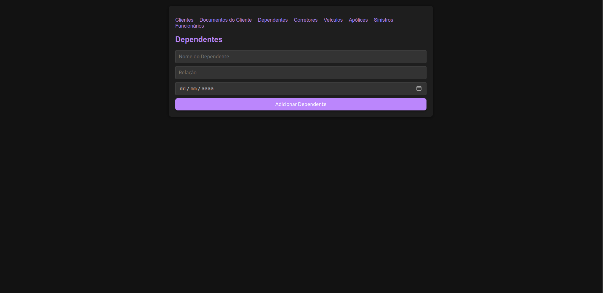

# USE CASE: Dependentes Cliente

## UC0003 – Cadastrar Dependentes do Cliente

### 1. Histórico de Atualizações
| Data     | Versão | Solicitação      | Descrição   | Autor   |
|----------|--------|------------------|-------------|---------|
| 22/09    | 01     | Professor Silvio  | Use Case    | Gabriel |

### 2. Descrição do Caso de Uso
O objetivo deste caso de uso é cadastrar dependentes de um cliente no sistema, incluindo informações como nome, relação com o cliente e data de nascimento.

### 3. Pré-Condições
- O Usuário deve estar autenticado no sistema.
- O Usuário deve ter acesso de Inclusão, Alteração e Exclusão de Dependentes (Roles: `INCLUIR_DEPENDENTES`, `ALTERAR_DEPENDENTES`, `EXCLUIR_DEPENDENTES`).
- O Cliente deve estar previamente cadastrado no sistema.

### 4. Atores
- **Usuário**: Pessoa que interage com o sistema para cadastrar dependentes de clientes.

### 5. Fluxos

#### Fluxo Principal
1. O sistema verifica o perfil do usuário. (RN-0001)
2. O sistema exibe o formulário para preenchimento dos dados do Dependente. (T01)
3. O usuário preenche os dados do Dependente.
4. O usuário clica em "Salvar".
5. O sistema verifica a consistência das informações. (RN-0005)
6. O sistema associa o dependente ao Cliente.
7. O sistema exibe uma mensagem de confirmação de sucesso e o número único de registro do Dependente. (RN-0002) (M1)
8. Fim do caso de uso.

#### Fluxos Alternativos

**Fluxo A1 – Dados obrigatórios não preenchidos**
1. O usuário tenta avançar sem preencher um ou mais campos obrigatórios.
2. O sistema identifica os campos faltantes e exibe uma mensagem de erro. (M2)
3. O usuário preenche os campos obrigatórios faltantes e tenta salvar novamente.
4. Retorna ao passo 4 do fluxo principal.

**Fluxo A2 – Dependente já cadastrado**
1. O sistema detecta que o nome e a data de nascimento informados já estão cadastrados para o Cliente. (RN-0003)
2. O sistema exibe uma mensagem de erro. (M3)
3. O usuário corrige os dados do Dependente.
4. Retorna ao passo 4 do fluxo principal.

### 6. Regras
| Referência | Regra                                                                 |
|------------|----------------------------------------------------------------------|
| RN-0001    | O usuário deve ter acesso às opções de inclusão, alteração e exclusão. |
| RN-0002    | O código do Dependente é gerado automaticamente pelo banco de dados de modo sequencial. |
| RN-0003    | Não poderá existir mais de um registro com o mesmo nome e data de nascimento para o mesmo Cliente. |
| RN-0004    | O Dependente só pode ser cadastrado se todos os campos obrigatórios estiverem preenchidos. |
| RN-0005    | Os dados inseridos devem ser válidos com a realidade.                |

### 7. Tabela de Mensagens
| Referência | Mensagem                              |
|------------|---------------------------------------|
| M1         | Registro de dependente efetuado com sucesso.       |
| M2         | Registro de dependente não efetuado.               |
| M3         | Dependente já cadastrado para este Cliente.        |

### 8. Tabela de Validação de Campos da Tela
| Campo              | Tipo    | Tam | Máscara | Obrig | Vlr. Válido    | Tabela       | Msg Erro         |
|--------------------|---------|-----|---------|-------|----------------|--------------|------------------|
| id_dependente      | Inteiro |     |         | Sim   | TipoDependente |              |                  |
| id_cliente          | Inteiro |     |         | Sim   | TipoDependente |              | Campo obrigatório |
| nome_dependente     | Texto   | 255 |         | Sim   | TipoDependente |              | Campo obrigatório |
| relacao            | Texto   | 255 |         | Sim   | TipoDependente |              | Campo obrigatório |
| data_nascimento    | Data    |     |         | Sim   | TipoDependente |              | Campo obrigatório |

## 9. Protótipos de Tela/Relatórios

