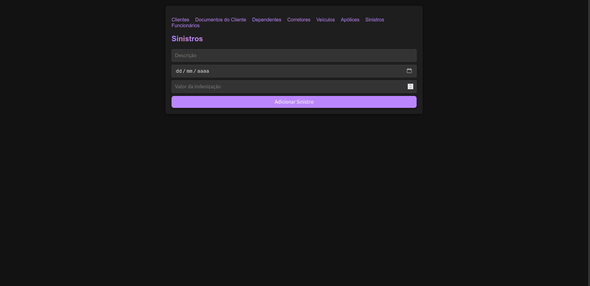

# USE CASE: Sinistros

## UC0007 – Cadastrar Sinistros

### 1. Histórico de Atualizações
| Data     | Versão | Solicitação      | Descrição   | Autor   |
|----------|--------|------------------|-------------|---------|
| 22/09    | 01     | Professor Silvio  | Use Case    | Gabriel |

### 2. Descrição do Caso de Uso
O objetivo deste caso de uso é cadastrar sinistros no sistema, incluindo informações sobre a descrição do sinistro, data de ocorrência, valor da indenização e associação com uma apólice e um veículo.

### 3. Pré-Condições
- O Usuário deve estar autenticado no sistema.
- O Usuário deve ter acesso de Inclusão, Alteração e Exclusão de Sinistros (Roles: `INCLUIR_SINISTROS`, `ALTERAR_SINISTROS`, `EXCLUIR_SINISTROS`).
- A Apólice e o Veículo devem estar previamente cadastrados no sistema.

### 4. Atores
- **Usuário**: Pessoa que interage com o sistema para cadastrar sinistros.

### 5. Fluxos

#### Fluxo Principal
1. O sistema verifica o perfil do usuário. (RN-0001)
2. O sistema exibe o formulário para preenchimento dos dados do Sinistro. (T01)
3. O usuário preenche os dados do Sinistro.
4. O usuário clica em "Salvar".
5. O sistema verifica a consistência das informações. (RN-0005)
6. O sistema associa o sinistro à Apólice e ao Veículo.
7. O sistema exibe uma mensagem de confirmação de sucesso e o número único de registro do Sinistro. (RN-0002) (M1)
8. Fim do caso de uso.

#### Fluxos Alternativos

**Fluxo A1 – Dados obrigatórios não preenchidos**
1. O usuário tenta avançar sem preencher um ou mais campos obrigatórios.
2. O sistema identifica os campos faltantes e exibe uma mensagem de erro. (M2)
3. O usuário preenche os campos obrigatórios faltantes e tenta salvar novamente.
4. Retorna ao passo 4 do fluxo principal.

**Fluxo A2 – Sinistro já cadastrado**
1. O sistema detecta que um sinistro com as mesmas informações já está cadastrado. (RN-0003)
2. O sistema exibe uma mensagem de erro. (M3)
3. O usuário corrige os dados do Sinistro.
4. Retorna ao passo 4 do fluxo principal.

### 6. Regras
| Referência | Regra                                                                 |
|------------|----------------------------------------------------------------------|
| RN-0001    | O usuário deve ter acesso às opções de inclusão, alteração e exclusão. |
| RN-0002    | O código do Sinistro é gerado automaticamente pelo banco de dados de modo sequencial. |
| RN-0003    | Não poderá existir mais de um registro com a mesma descrição e data de ocorrência. |
| RN-0004    | O Sinistro só pode ser cadastrado se todos os campos obrigatórios estiverem preenchidos. |
| RN-0005    | Os dados inseridos devem ser válidos com a realidade.                |

### 7. Tabela de Mensagens
| Referência | Mensagem                                  |
|------------|-------------------------------------------|
| M1         | Registro de sinistro efetuado com sucesso.|
| M2         | Registro de sinistro não efetuado.        |
| M3         | Sinistro já cadastrado no sistema.       |

### 8. Tabela de Validação de Campos da Tela
| Campo                 | Tipo      | Tam | Máscara | Obrig | Vlr. Válido     | Tabela        | Msg Erro         |
|-----------------------|-----------|-----|---------|-------|-----------------|--------------|------------------|
| id_sinistro           | Inteiro   |     |         | Sim   | TipoSinistro    |              |                  |
| descricao             | Texto     |     |         | Sim   | TipoSinistro    |              | Campo obrigatório |
| data_ocorrencia       | Data      |     |         | Sim   | TipoSinistro    |              | Campo obrigatório |
| valor_indenizacao      | Decimal   |     |         | Sim   | TipoSinistro    |              | Campo obrigatório |
| id_apolice            | Inteiro   |     |         | Sim   | TipoSinistro    | Apolices     | Campo obrigatório |
| id_veiculo            | Inteiro   |     |         | Sim   | TipoSinistro    | Veiculos     | Campo obrigatório |

## 9. Protótipos de Tela/Relatórios

