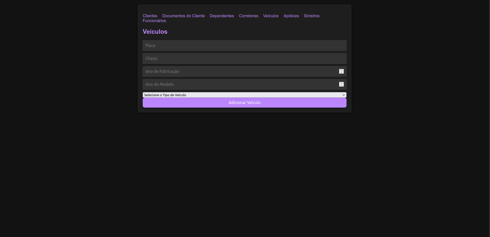

# USE CASE: Veículos

## UC0005 – Cadastrar Veículos

### 1. Histórico de Atualizações
| Data     | Versão | Solicitação      | Descrição   | Autor   |
|----------|--------|------------------|-------------|---------|
| 22/09    | 01     | Professor Silvio  | Use Case    | Gabriel |

### 2. Descrição do Caso de Uso
O objetivo deste caso de uso é cadastrar veículos no sistema, incluindo informações como placa, chassi, marca, modelo e associação com um cliente.

### 3. Pré-Condições
- O Usuário deve estar autenticado no sistema.
- O Usuário deve ter acesso de Inclusão, Alteração e Exclusão de Veículos (Roles: `INCLUIR_VEICULOS`, `ALTERAR_VEICULOS`, `EXCLUIR_VEICULOS`).
- O Cliente deve estar previamente cadastrado no sistema.
- As marcas, modelos e tipos de veículos devem estar previamente cadastrados.

### 4. Atores
- **Usuário**: Pessoa que interage com o sistema para cadastrar veículos.

### 5. Fluxos

#### Fluxo Principal
1. O sistema verifica o perfil do usuário. (RN-0001)
2. O sistema exibe o formulário para preenchimento dos dados do Veículo. (T01)
3. O usuário preenche os dados do Veículo.
4. O usuário clica em "Salvar".
5. O sistema verifica a consistência das informações. (RN-0005)
6. O sistema associa o veículo ao Cliente.
7. O sistema exibe uma mensagem de confirmação de sucesso e o número único de registro do Veículo. (RN-0002) (M1)
8. Fim do caso de uso.

#### Fluxos Alternativos

**Fluxo A1 – Dados obrigatórios não preenchidos**
1. O usuário tenta avançar sem preencher um ou mais campos obrigatórios.
2. O sistema identifica os campos faltantes e exibe uma mensagem de erro. (M2)
3. O usuário preenche os campos obrigatórios faltantes e tenta salvar novamente.
4. Retorna ao passo 4 do fluxo principal.

**Fluxo A2 – Veículo já cadastrado**
1. O sistema detecta que a placa informada já está cadastrada. (RN-0003)
2. O sistema exibe uma mensagem de erro. (M3)
3. O usuário corrige os dados do Veículo.
4. Retorna ao passo 4 do fluxo principal.

### 6. Regras
| Referência | Regra                                                                 |
|------------|----------------------------------------------------------------------|
| RN-0001    | O usuário deve ter acesso às opções de inclusão, alteração e exclusão. |
| RN-0002    | O código do Veículo é gerado automaticamente pelo banco de dados de modo sequencial. |
| RN-0003    | Não poderá existir mais de um registro com a mesma placa.            |
| RN-0004    | O Veículo só pode ser cadastrado se todos os campos obrigatórios estiverem preenchidos. |
| RN-0005    | Os dados inseridos devem ser válidos com a realidade.                |

### 7. Tabela de Mensagens
| Referência | Mensagem                                |
|------------|-----------------------------------------|
| M1         | Registro de veículo efetuado com sucesso.      |
| M2         | Registro de veículo não efetuado.            |
| M3         | Veículo já cadastrado no sistema.           |

### 8. Tabela de Validação de Campos da Tela
| Campo                | Tipo    | Tam | Máscara | Obrig | Vlr. Válido     | Tabela        | Msg Erro         |
|----------------------|---------|-----|---------|-------|-----------------|---------------|------------------|
| id_veiculo           | Inteiro |     |         | Sim   | TipoVeiculo     |               |                  |
| placa                | Texto   | 10  |         | Sim   | TipoVeiculo     |               | Campo obrigatório |
| chassi               | Texto   | 255 |         | Sim   | TipoVeiculo     |               | Campo obrigatório |
| id_marca             | Inteiro |     |         | Sim   | TipoVeiculo     | Marca         | Campo obrigatório |
| id_modelo            | Inteiro |     |         | Sim   | TipoVeiculo     | Modelo        | Campo obrigatório |
| ano_fabricacao       | Ano     |     |         | Sim   | TipoVeiculo     |               | Campo obrigatório |
| ano_modelo           | Ano     |     |         | Sim   | TipoVeiculo     |               | Campo obrigatório |
| id_cliente           | Inteiro |     |         | Sim   | TipoVeiculo     | Clientes      | Campo obrigatório |
| id_tipo_veiculo      | Inteiro |     |         | Sim   | TipoVeiculo     | TiposVeiculo  | Campo obrigatório |

## 9. Protótipos de Tela/Relatórios

